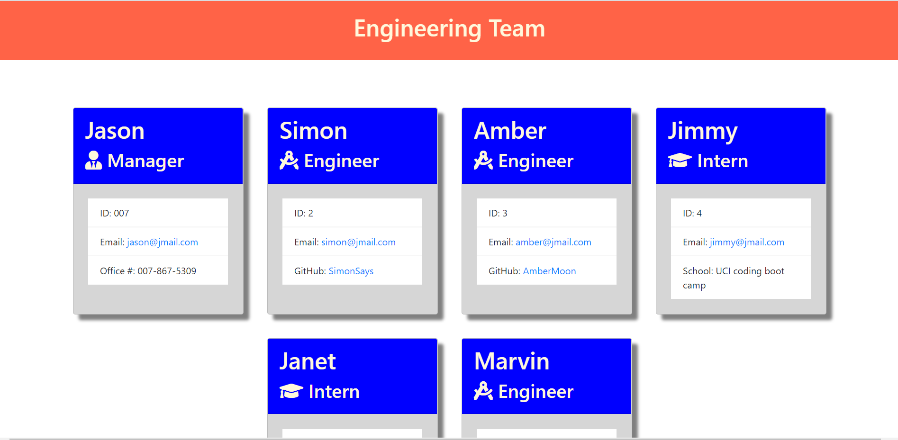

# Template-Engine-Employee-Summary

This is a software engineering team generator command line application. The application will prompt the user for information about the team manager and then information about the team members. The user can input any number of team members, and they may be a mix of engineers and interns. When the user has completed building the team, the application will create an HTML file that displays a nicely formatted team roster based on the information provided by the user. 

## How to use

1. Clone the repository to your machine
2. Open the cloned repository in your text editor
3. Open your terminal and navigate to the working directory 
4. Type "npm install" in your terminal to download all of the node dependencies
5. Type "node app.js" in your terminal to run the application
6. Answer the prompts
7. At the end you should get a console.log of your success!
8. An HTML file should show up as "output/team.html"
9. Open the newly created HTML file in your browser

